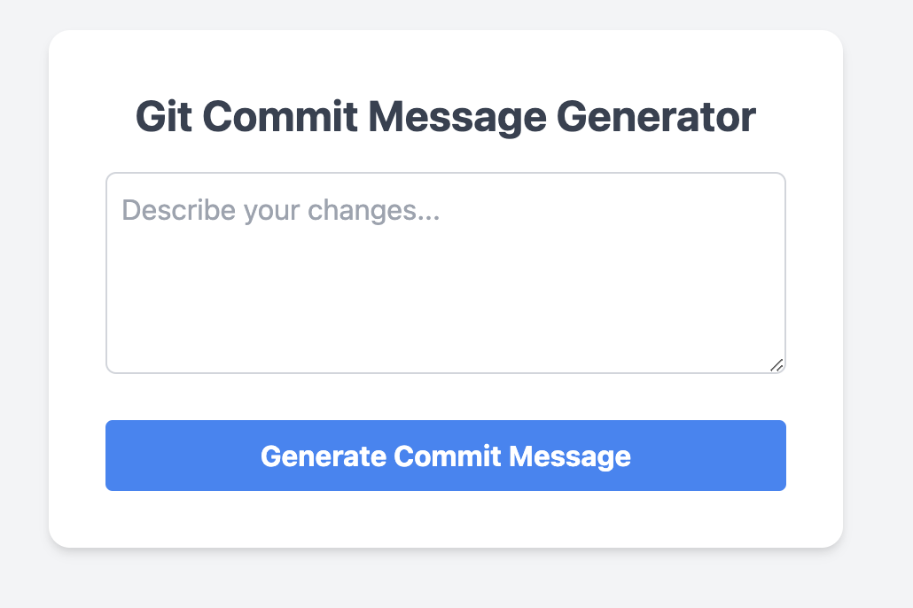

# CommitCompact

## Overview
A web-based tool designed to help developers create concise, meaningful, and standardized commit messages for their Git repositories. By inputting a detailed description of their code changes, users can generate a summarized, clear commit message that adheres to best practices.




## Features
- **Detailed to Concise**: Transforms detailed descriptions of code changes into concise, clear commit messages.
- **Customizable Templates**: Offers different templates for various types of commits (e.g., feature, fix, refactor, documentation).
- **Easy to Use**: Simple and intuitive interface for quick generation of commit messages.
- **Copy Functionality**: Allows users to easily copy the generated commit message to the clipboard.

## Getting Started

### Prerequisites
- Python 3.x
- Flask
- OpenAI API Key

### Installation
1. Clone the repository:
   ```bash git clone https://github.com/yourusername/git-commit-message-generator.git```

2. Navigate to the project directory:
```bash cd git-commit-message-generator```

3. Install the required packages:
    ```pip install -r requirements.txt```
4. Set your OpenAI API key as an environment variable:
    ```export OPENAI_API_KEY='your_api_key_here'```

5. Run it:
   ```python3 app.py```
